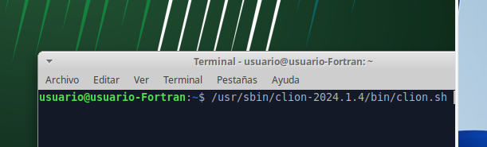
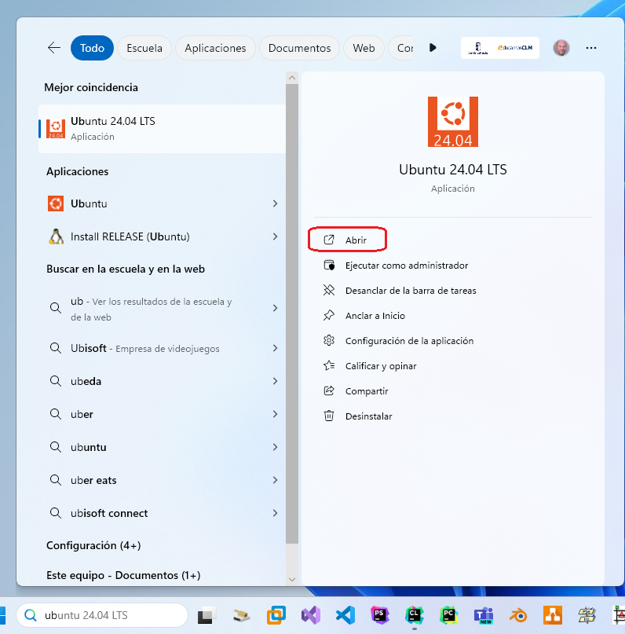

# Motivación
Tras más de veinte años en el mundo de la programación y la enseñanza, sentía que me faltaba algo, que tenía algún conocimiento un poco cojo. 

Una vez aprendidos los lenguajes de ensamblador (z80, i386), funcionales (lisp, haskel), declarativos (prolog), estructurados (pascal, c, basic, cobol) y posteriormente los orientados a objetos (C++, java, visual basic, object pascal). Después de aprender desarrollo en Desktop linux (Gnome, Kde), windows (C#, .net, Visual Basic) y android (Java, C++); programar tanto frontend (JavaScript, PyScript) como backend (Php, NodeJS, Django, Flask, Java) y utilizar bases de datos relacionales (Oracle, MySql, MariaDB, PostGre) y documentales (MongoDB) bajo SQL y POO. Tras  realizar mis pinitos en Big Data e Inteligencia Artificial con Python, CUDA y  frontends (PyTorch, Tensorflow). Una vez conocido el mundo de los microservicios (Docker, Php y javascript), me parecía que faltaba algo. 

Investigando los nuevos lenguajes que van apareciendo, no me llenaba ninguno, son nuevas formas de hacer lo mismo. Seguí investigando y un vistazo rápido a los índices (sí, ya sé que no son muy fiables) de uso de software me sorprendió que fortran estaba subiendo rápidamente en los últimos meses. Me pregunté cómo podía ser posible que un nicho de mercado tan concreto tuviera esa evolución. Después de una búsqueda a través de páginas y artículos tanto científicos como foráneos, llegué a la conclusión que se debía a que mejoraba notablemente una característica de Python (la velocidad) y era tan útil en la programación más actual (IA y Big Data).

Así que llegué a la conclusión que Fortran está empezando a crecer porque es tan rápido como C y tiene el acceso a las librerías de Big Data e Inteligencia Artificial similares a las de Python. Algunos test que he visto por internet, mejoran hasta en 16 veces la velocidad de los cálculos sobre python (numpy escrita en C), si bien no se puede utilizar como referencia, en media sí puede llegar hasta ser cuatro veces más rápido.

Dada la potencia actual de cálculo y las necesidades del mismo, una mejora de cuatro veces es significativa, por lo que hay que tener en consideración el uso de Fortran para este campo de investigación.

## Problemas encontrados
Con el nuevo ámbito en el que trabajaría escogido, me lancé a buscar libros y documentación sobre el tema. Mi sorpresa fue mayúscula cuando en castellano no encontré más que algún tutorial y documentación poco traducida, teniendo en cuenta que es un lenguaje del siglo pasado. Esta situación me llevó a formularme dos premisas: 
- El castellano no se utiliza en el ámbito científico.
- No se publican estudios relacionados con Fortran en castellano.

Dada la situación decidí aprender Fortran, pero realizar una labor de traducción sobre algún libro de la materia.

Ahora había que buscar libros y seleccionar autores. Esta investigación me llevó a: "Modern Fortran Explained: Incorporating Fortran 2023 (Numerical Mathematics and Scientific Computation)" de Mr Michael Metcalf, Dr John Reid, Mr Malcolm Cohen, Dr Reinhold Bader.

Está muy bien valorado en diversas universidades y foros de Fortran así que me he lanzado a la aventura.

# Instalación
Pero antes de comenzar la traducción y el aprendizaje propiamente dicho, tenemos que configurar el sistema para poder programar bajo Fortran. La decisión no es sencilla y se verá que se complica más con las diferentes versiones del lenguaje que han ido apareciendo. A continuación, veremos la configuración bajo Linux y Windows que me ha parecido más sencilla, si bien no es la única (Ver el compilador Fortran de Intel).

## Bajo Linux
Si decidimos usar linux para el desarrollo podemos usar cualquier distribución, nos hemos decantado por la última de Ubuntu en este momento 24.04 (Xubuntu en mi caso) que puede instalar la última versión del compilador Gnu Fortran (Versión 14) sin esfuerzo. 

Primero instalamos fortran:

Y para terminar configuramos el intérprete por defecto

### Configuración en CLion
Clion es un IDE desarrollado por JetBrains que tiene licencia libre y para estudiantes gratuita, no es el único IDE disponible y podremos usar el que deseemos. Recomiendo usar Visual Studio Code en caso de cambiar, por las facilidades que presenta.

Podremos optar por la instalación manual o automática desde snap.

#### Instalación manual
Una vez descargado el fichero tar.gz desde JetBrains.

##### Ejecución manual

#### Instalación desde snap

#### Configuración de Clion para Fortran
Arrancaremos Clion y crearemos un proyecto cualquiera, lo primero es configurar el entorno para Fortran y se hace instalando un plugin dentro de los Settings.

Una vez instalado, ya podemos reiniciar y crear ahora sí, un proyecto fortran.

#### Ejecución del primer proyecto.
Ya estamos dispuestos, pulsaremos en el icono de play y si todo es correcto veremos algo como la siguiente imagen.

## Bajo Windows
Si en vez de linux queremos usar Windows, tengo malas noticias (a medias) no es recomendable. Pero gracias a la tecnología WSL de Windows (es un Linux bajo Windows) podemos realizar las mismas tareas.

### Instalación de WSL-2
WSL es una tecnología que virtualiza un SSOO linux bajo windows. En nuestro caso instalaremos Ubnuntu 24.04. El proceso es sencillo, desde la APP store de windows le damos instalar.

Y a continuación accedemos con un shell a dicha distribución.

Para configurarlo igual que en la versión linux.

La instalación de CLion bajo windows no oculta ningún tipo de secreto, pero la configuración sí.

### Configuración en CLion para Fortran
Arrancaremos Clion y crearemos un proyecto cualquiera, lo primero es configurar el entorno para Fortran y se hace instalando un plugin dentro de los Settings.

Una vez instalado, ya podemos reiniciar y crear ahora sí, un proyecto fortran.

**Cuidado, todavía no se puede ejecutar nada**

Pasamos ahora, a terminar las configuraciones de CLion. Es hora de crear la cadena de ejecución: Hay que decir al IDE que use el WSL-2 de ubuntu 24.04 en vez de buscar en la máquina windows. Bajo los settings ir a toolchains:

Hay que tener en cuenta que este IDE está pensado para C y ya tendrá un toolchain por defecto (MinGW), el nuestro debe aparecer en la pila el primero. Dando al más (+) creamos el tipo y lo configuramos como aparece en la imagen.

Si creamos otro proyecto fortran ahora, estará todo configurado y correcto.

Podemos ver como en la parte superior derecha aparecen los iconos para la ejecución y depuración del mismo.

## Ejecución del primer proyecto.
Ya estamos dispuestos, pulsaremos en el icono de play y si todo es correcto veremos algo como la siguiente imagen.

## Felicidades
Si todo ha ido bien, tenemos un entorno de ejecución configurado tanto en Linux como en Windows para nuestro aprendizaje.

